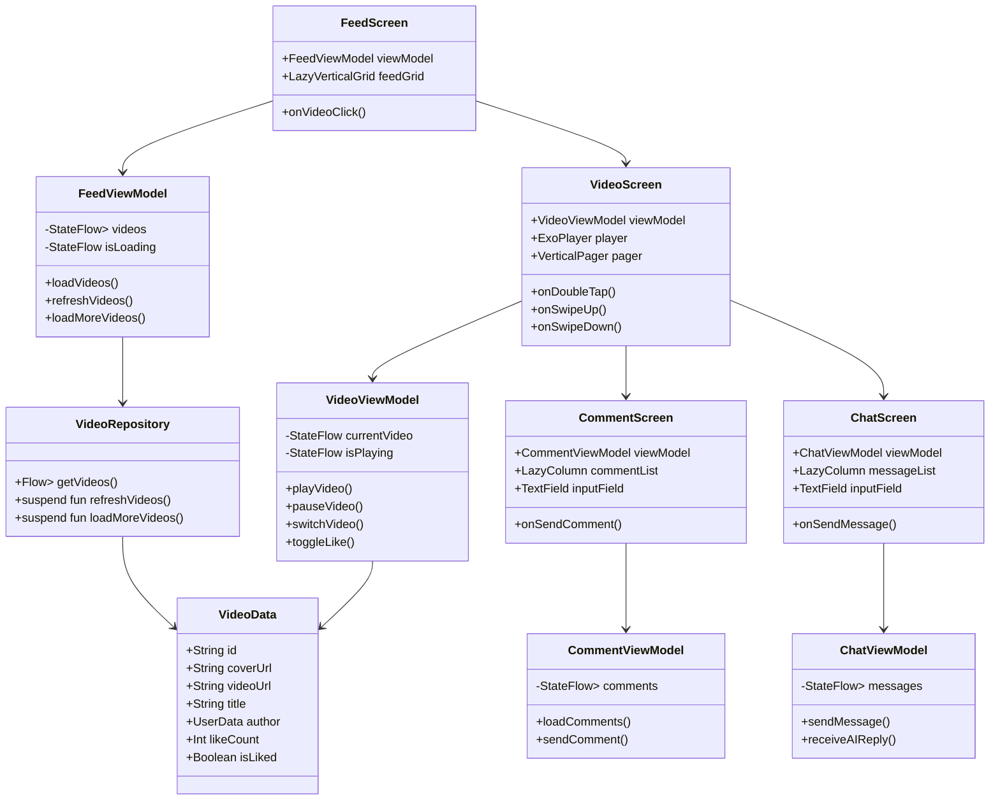
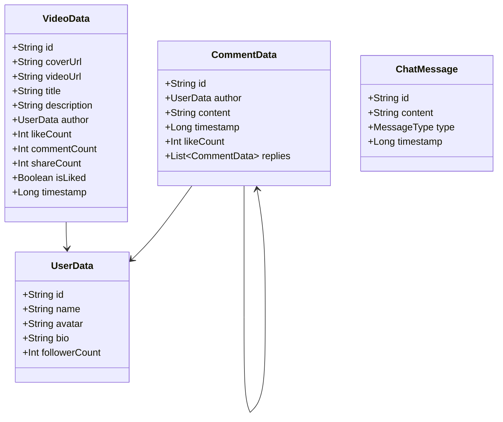

# SmallDY 短视频应用技术设计文档

## 1. 项目目标

### 1.1 核心目标
- 实现一个类似抖音的短视频应用，包含双列外流、视频内流、评论系统和AI问答功能
- 整体运行流畅，无崩溃卡死，界面UI和交互风格统一，整体呈现效果美观
- 支持滑动1~2屏仍有元素展示，提供良好的用户体验

### 1.2 功能目标
- **双列外流**：实现瀑布流布局，展示视频封面、标题、作者信息、点赞数等
- **视频内流**：全屏视频播放，支持上下滑动切换、播放控制、互动功能
- **评论系统**：支持查看和发布评论，实时更新评论列表
- **AI问答**：提供悬浮球入口，支持与AI进行对话交互

## 2. 技术选型

### 2.1 架构模式
**选择：MVVM（Model-View-ViewModel）**

**原因：**
- 清晰的职责分离：View负责UI展示，ViewModel处理业务逻辑，Model管理数据
- 数据驱动UI：通过StateFlow/LiveData实现响应式编程
- 易于测试：ViewModel可独立测试，不依赖UI
- 生命周期感知：与Android生命周期良好集成
- 符合Jetpack Compose的最佳实践

### 2.2 核心技术栈

| 技术 | 版本/说明 | 用途 |
|------|----------|------|
| **Kotlin** | 1.9+ | 主要开发语言 |
| **Jetpack Compose** | 2025.08.00 BOM | UI框架 |
| **Accompanist** | 0.32.0+ | Compose扩展库 |
| **Navigation Compose** | 2.7.7 | 页面导航 |
| **ExoPlayer** | 2.19.1 | 视频播放引擎 |
| **Coil** | 2.6.0 | 图片加载库 |
| **ViewModel** | lifecycle-viewmodel-compose | 状态管理 |
| **StateFlow/Flow** | kotlinx-coroutines | 数据流 |
| **Retrofit** | 2.9.0 | 网络请求（如需要） |
| **Room** | 2.6.1 | 本地数据库（如需要） |

### 2.3 关键组件库说明

#### Accompanist 组件
Accompanist 是 Google 官方维护的 Jetpack Compose 扩展库集合，提供以下关键功能：

1. **accompanist-pager**：实现ViewPager功能，支持左右滑动切换Tab
2. **accompanist-swiperefresh**：下拉刷新组件
3. **accompanist-navigation-animation**：导航转场动画
4. **accompanist-permissions**：权限管理
5. **accompanist-systemuicontroller**：系统UI控制

**GitHub仓库**：https://github.com/google/accompanist

#### ExoPlayer
- 支持多种视频格式（MP4, HLS, DASH等）
- 高性能硬件加速
- 支持预加载和缓存
- 丰富的播放控制API

## 3. 架构设计

### 3.1 MVVM架构图

```
┌─────────────────────────────────────────────────────────────┐
│                         UI Layer                             │
│  ┌──────────┐  ┌──────────┐  ┌──────────┐  ┌──────────┐   │
│  │FeedScreen│  │VideoScreen│ │CommentScreen│ │ChatScreen│   │
│  └────┬─────┘  └────┬─────┘  └────┬─────┘  └────┬─────┘   │
│       │             │              │              │          │
└───────┼─────────────┼──────────────┼──────────────┼──────────┘
        │             │              │              │
        ▼             ▼              ▼              ▼
┌─────────────────────────────────────────────────────────────┐
│                      ViewModel Layer                         │
│  ┌──────────┐  ┌──────────┐  ┌──────────┐  ┌──────────┐   │
│  │FeedViewModel│ │VideoViewModel│ │CommentViewModel│ │ChatViewModel│   │
│  └────┬─────┘  └────┬─────┘  └────┬─────┘  └────┬─────┘   │
│       │             │              │              │          │
└───────┼─────────────┼──────────────┼──────────────┼──────────┘
        │             │              │              │
        ▼             ▼              ▼              ▼
┌─────────────────────────────────────────────────────────────┐
│                       Repository Layer                       │
│  ┌──────────┐  ┌──────────┐  ┌──────────┐  ┌──────────┐   │
│  │VideoRepository│ │UserRepository│ │CommentRepository│ │AIRepository│   │
│  └────┬─────┘  └────┬─────┘  └────┬─────┘  └────┬─────┘   │
│       │             │              │              │          │
└───────┼─────────────┼──────────────┼──────────────┼──────────┘
        │             │              │              │
        ▼             ▼              ▼              ▼
┌─────────────────────────────────────────────────────────────┐
│                        Data Layer                            │
│  ┌──────────┐  ┌──────────┐  ┌──────────┐  ┌──────────┐   │
│  │RemoteDataSource│ │LocalDataSource│ │CacheManager│ │AIService│   │
│  └──────────┘  └──────────┘  └──────────┘  └──────────┘   │
└─────────────────────────────────────────────────────────────┘
```

### 3.2 包结构设计

```
com.example.smalldy/
├── data/
│   ├── model/              # 数据模型
│   │   ├── VideoData.kt
│   │   ├── UserData.kt
│   │   ├── CommentData.kt
│   │   └── ChatMessage.kt
│   ├── repository/         # 数据仓库
│   │   ├── VideoRepository.kt
│   │   ├── UserRepository.kt
│   │   └── CommentRepository.kt
│   └── local/              # 本地数据源
│       └── MockDataSource.kt
├── domain/                 # 业务逻辑层（可选）
│   └── usecase/
├── ui/
│   ├── feed/               # 双列外流
│   │   ├── FeedScreen.kt
│   │   ├── FeedViewModel.kt
│   │   └── FeedCard.kt
│   ├── video/              # 视频内流
│   │   ├── VideoScreen.kt
│   │   ├── VideoViewModel.kt
│   │   ├── VideoPlayer.kt
│   │   └── VideoControls.kt
│   ├── comment/            # 评论页面
│   │   ├── CommentScreen.kt
│   │   ├── CommentViewModel.kt
│   │   └── CommentItem.kt
│   ├── chat/               # AI问答
│   │   ├── ChatScreen.kt
│   │   ├── ChatViewModel.kt
│   │   └── FloatingBall.kt
│   └── common/             # 公共组件
│       ├── TopNav.kt
│       ├── BottomNav.kt
│       └── RefreshIndicator.kt
└── util/                   # 工具类
    ├── ImagePicker.kt
    └── VideoUtils.kt
```

## 4. 类图设计

### 4.1 核心类图



### 4.2 数据模型类图



## 5. 功能实现思路和难点

### 5.1 双列外流（Feed流）

#### 5.1.1 UI布局实现

**技术方案：**
- 使用 `LazyVerticalGrid` 实现双列布局
- 每个卡片包含：封面图、标题、作者信息、点赞数

**实现代码结构：**
```kotlin
@Composable
fun FeedScreen(viewModel: FeedViewModel = hiltViewModel()) {
    val videos by viewModel.videos.collectAsState()
    val isLoading by viewModel.isLoading.collectAsState()
    
    LazyVerticalGrid(
        columns = GridCells.Fixed(2),
        contentPadding = PaddingValues(8.dp),
        horizontalArrangement = Arrangement.spacedBy(8.dp),
        verticalArrangement = Arrangement.spacedBy(8.dp)
    ) {
        items(videos) { video ->
            FeedCard(
                video = video,
                onClick = { viewModel.navigateToVideo(video.id) }
            )
        }
    }
}
```

#### 5.1.2 点击封面进入视频内流

**实现思路：**
- 在 `FeedCard` 的封面图上添加 `Modifier.clickable`
- 使用 Navigation Compose 导航到 `VideoScreen`
- 传递视频ID作为参数

**转场动画实现（难点）：**
- 使用 Accompanist 的 `SharedElement` 或 Compose 的 `SharedTransitionLayout`
- 在封面图和视频播放器之间建立共享元素
- 实现从封面位置到全屏的放大动画

**关键代码：**
```kotlin
// 在外流中使用 SharedTransitionLayout
SharedTransitionLayout {
    AsyncImage(
        model = video.coverUrl,
        modifier = Modifier
            .sharedElement(
                rememberSharedContentState(key = video.id),
                this@SharedTransitionLayout
            )
    )
}

// 在视频内流中使用相同的key
SharedTransitionLayout {
    VideoPlayer(
        video = video,
        modifier = Modifier
            .sharedElement(
                rememberSharedContentState(key = video.id),
                this@SharedTransitionLayout
            )
    )
}
```

#### 5.1.3 卡片高度自适应

**实现思路：**
- 使用 `wrapContentHeight()` 让卡片根据内容自适应
- 标题使用 `maxLines` 限制行数，超出显示省略号
- 固定封面图比例（如3:4）

**难点：**
- 双列布局中，左右两列高度可能不一致
- 需要确保视觉平衡

**解决方案：**
- 使用 `StaggeredGrid` 或自定义布局
- 或者固定卡片最小高度，确保基本一致

#### 5.1.4 下拉刷新和上拉加载

**技术方案：**
- 使用 Accompanist 的 `SwipeRefresh` 实现下拉刷新
- 使用 `LazyListState` 监听滚动位置，实现上拉加载

**自定义刷新动画：**
```kotlin
@Composable
fun CustomRefreshIndicator() {
    // 自定义刷新动画，如旋转图标、加载文字等
    CircularProgressIndicator()
    Text("正在刷新...")
}
```

**实现代码：**
```kotlin
val listState = rememberLazyListState()

SwipeRefresh(
    state = rememberSwipeRefreshState(isRefreshing),
    onRefresh = { viewModel.refreshVideos() },
    indicator = { state, trigger ->
        CustomRefreshIndicator()
    }
) {
    LazyVerticalGrid(
        state = listState,
        // ...
    ) {
        // 监听滚动到底部
        LaunchedEffect(listState) {
            snapshotFlow {
                listState.layoutInfo.visibleItemsInfo.lastOrNull()?.index
            }.collect { lastIndex ->
                if (lastIndex == videos.size - 1) {
                    viewModel.loadMoreVideos()
                }
            }
        }
    }
}
```

#### 5.1.5 顶部和底部Bar实现

**实现思路：**
- 使用 `Scaffold` 的 `topBar` 和 `bottomBar` 参数
- `TopNav` 显示Tab导航（司城、团购、直播、商城、推荐）
- `BottomNav` 显示底部导航（首页、朋友、消息、我）

**代码结构：**
```kotlin
Scaffold(
    topBar = {
        TopNav(
            navItems = navItems,
            onTabClick = { viewModel.switchTab(it) }
        )
    },
    bottomBar = {
        BottomNav(
            activeTab = currentTab,
            onTabChange = { viewModel.switchBottomTab(it) }
        )
    }
) { paddingValues ->
    // 内容区域
}
```

#### 5.1.6 左右滑动切换顶部Bar（较难）

**技术方案：**
- 使用 Accompanist 的 `HorizontalPager` 实现左右滑动
- 使用 `TabRow` 显示顶部导航
- 实现 Pager 和 TabRow 的联动

**实现思路：**
```kotlin
val pagerState = rememberPagerState(pageCount = { tabs.size })

Column {
    TabRow(selectedTabIndex = pagerState.currentPage) {
        tabs.forEachIndexed { index, tab ->
            Tab(
                selected = pagerState.currentPage == index,
                onClick = { coroutineScope.launch { pagerState.animateScrollToPage(index) } }
            ) {
                Text(tab.label)
            }
        }
    }
    
    HorizontalPager(
        state = pagerState,
        modifier = Modifier.fillMaxSize()
    ) { page ->
        when (page) {
            0 -> FeedScreen()
            1 -> GroupBuyScreen()
            // ...
        }
    }
}
```

**难点：**
- 手势冲突：需要处理左右滑动和上下滚动的冲突
- 性能优化：预加载相邻页面内容

### 5.2 视频内流（Video Stream）

#### 5.2.1 内流页面布局

**布局结构：**
```
┌─────────────────────────┐
│     视频播放区域          │
│   (全屏，16:9或9:16)      │
│                          │
│  ┌────────┐  ┌────────┐ │
│  │  头像   │  │  点赞   │ │
│  │  昵称   │  │  评论   │ │
│  │  标题   │  │  分享   │ │
│  └────────┘  └────────┘ │
│                          │
│     音乐转盘              │
└─────────────────────────┘
```

**实现代码：**
```kotlin
@Composable
fun VideoScreen(videoId: String) {
    Box(modifier = Modifier.fillMaxSize()) {
        // 视频播放器
        VideoPlayer(
            video = currentVideo,
            modifier = Modifier.fillMaxSize()
        )
        
        // 左侧用户信息
        Column(
            modifier = Modifier
                .align(Alignment.BottomStart)
                .padding(16.dp)
        ) {
            UserInfo(video.author)
            VideoTitle(video.title)
        }
        
        // 右侧互动按钮
        Column(
            modifier = Modifier
                .align(Alignment.BottomEnd)
                .padding(16.dp)
        ) {
            LikeButton(video.isLiked, video.likeCount)
            CommentButton(video.commentCount)
            ShareButton()
        }
        
        // 音乐转盘
        MusicDisc(
            modifier = Modifier
                .align(Alignment.BottomStart)
                .offset(x = 16.dp, y = (-100).dp)
        )
    }
}
```

#### 5.2.2 点击暂停、播放

**实现思路：**
- 使用 ExoPlayer 的 `play()` 和 `pause()` 方法
- 监听播放状态，显示/隐藏暂停图标
- 在视频区域添加点击监听

**代码实现：**
```kotlin
@Composable
fun VideoPlayer(
    video: VideoData,
    modifier: Modifier = Modifier
) {
    val player = rememberExoPlayer(video.videoUrl)
    val isPlaying by player.isPlaying.collectAsState()
    
    Box(
        modifier = modifier
            .clickable { 
                if (isPlaying) player.pause() else player.play()
            }
    ) {
        AndroidView(
            factory = { context ->
                PlayerView(context).apply {
                    this.player = player
                }
            },
            modifier = Modifier.fillMaxSize()
        )
        
        if (!isPlaying) {
            Icon(
                imageVector = Icons.Default.PlayArrow,
                contentDescription = "播放",
                modifier = Modifier
                    .align(Alignment.Center)
                    .size(64.dp)
            )
        }
    }
}
```

#### 5.2.3 手指上下移动、切换视频（中等难度）

**技术方案：**
- 使用 `VerticalPager` 实现上下滑动切换
- 每个页面包含一个视频播放器
- 实现视频预加载机制

**实现代码：**
```kotlin
val pagerState = rememberPagerState(pageCount = { videos.size })

VerticalPager(
    state = pagerState,
    modifier = Modifier.fillMaxSize()
) { page ->
    VideoPlayerItem(
        video = videos[page],
        isActive = pagerState.currentPage == page
    )
}

// 预加载逻辑
LaunchedEffect(pagerState.currentPage) {
    val current = pagerState.currentPage
    // 预加载下一个视频
    if (current < videos.size - 1) {
        viewModel.preloadVideo(videos[current + 1].id)
    }
}
```

**预加载实现（进阶）：**
```kotlin
class VideoViewModel {
    private val preloadPlayers = mutableMapOf<String, ExoPlayer>()
    
    fun preloadVideo(videoId: String) {
        if (!preloadPlayers.containsKey(videoId)) {
            val player = ExoPlayer.Builder(context).build()
            player.setMediaItem(MediaItem.fromUri(video.videoUrl))
            player.prepare()
            player.playWhenReady = false
            preloadPlayers[videoId] = player
        }
    }
}
```

#### 5.2.4 双击点赞动画（中等难度）

**实现思路：**
- 使用 `Modifier.pointerInput` 检测双击事件
- 使用 `AnimatedVisibility` 或自定义动画显示点赞效果
- 触发点赞动画后，更新点赞状态

**代码实现：**
```kotlin
@Composable
fun VideoPlayer(
    video: VideoData,
    onDoubleTap: () -> Unit,
    modifier: Modifier = Modifier
) {
    var showLikeAnimation by remember { mutableStateOf(false) }
    
    Box(
        modifier = modifier
            .pointerInput(Unit) {
                detectTapGestures(
                    onDoubleTap = {
                        showLikeAnimation = true
                        onDoubleTap()
                        // 1秒后隐藏动画
                        kotlinx.coroutines.delay(1000)
                        showLikeAnimation = false
                    }
                )
            }
    ) {
        // 视频内容
        
        // 点赞动画
        AnimatedVisibility(
            visible = showLikeAnimation,
            enter = fadeIn() + scaleIn(),
            exit = fadeOut() + scaleOut()
        ) {
            Icon(
                imageVector = Icons.Default.Favorite,
                contentDescription = null,
                tint = Color.Red,
                modifier = Modifier
                    .align(Alignment.Center)
                    .size(80.dp)
            )
        }
    }
}
```

#### 5.2.5 音乐转盘和动画（中等难度）

**实现思路：**
- 使用 `Canvas` 绘制转盘
- 使用 `infiniteRepeatable` 动画实现旋转
- 根据播放状态控制动画

**代码实现：**
```kotlin
@Composable
fun MusicDisc(
    isPlaying: Boolean,
    modifier: Modifier = Modifier
) {
    val infiniteTransition = rememberInfiniteTransition(label = "disc_rotation")
    val rotation by infiniteTransition.animateFloat(
        initialValue = 0f,
        targetValue = 360f,
        animationSpec = infiniteRepeatable(
            animation = tween(3000, easing = LinearEasing),
            repeatMode = RepeatMode.Restart
        ),
        label = "rotation"
    )
    
    Canvas(
        modifier = modifier
            .size(60.dp)
    ) {
        // 绘制转盘
        drawCircle(
            color = Color.White.copy(alpha = 0.8f),
            radius = size.minDimension / 2
        )
        // 绘制中心点
        drawCircle(
            color = Color.Black,
            radius = 8.dp.toPx(),
            center = center
        )
    }
    
    // 根据播放状态控制旋转
    LaunchedEffect(isPlaying) {
        // 控制动画
    }
}
```

#### 5.2.6 下拉刷新和上拉加载

**实现思路：**
- 与外流类似，使用 `SwipeRefresh` 和 `VerticalPager` 的滚动监听
- 在视频列表顶部/底部添加刷新/加载逻辑

#### 5.2.7 支持头像更换（较难）

**功能需求：**
- 拍照选择头像
- 从图库选择头像
- 图片裁剪功能

**技术方案：**
- 使用 Accompanist 的 `Permissions` 处理相机和存储权限
- 使用 `ActivityResultContracts` 处理图片选择
- 集成图片裁剪库（如 `ucrop` 或自定义裁剪）

**实现代码结构：**
```kotlin
@Composable
fun AvatarPicker(
    onAvatarSelected: (Uri) -> Unit
) {
    val context = LocalContext.current
    val launcher = rememberLauncherForActivityResult(
        contract = ActivityResultContracts.PickVisualMedia()
    ) { uri ->
        uri?.let { onAvatarSelected(it) }
    }
    
    val cameraLauncher = rememberLauncherForActivityResult(
        contract = ActivityResultContracts.TakePicture()
    ) { success ->
        if (success) {
            // 处理拍照结果
        }
    }
    
    // 显示选择对话框
    AlertDialog(
        onDismissRequest = { },
        title = { Text("选择头像") },
        text = {
            Column {
                Button(onClick = { launcher.launch(PickVisualMediaRequest()) }) {
                    Text("从图库选择")
                }
                Button(onClick = { /* 打开相机 */ }) {
                    Text("拍照")
                }
            }
        }
    )
}
```

### 5.3 评论页面

#### 5.3.1 评论UI布局

**布局结构：**
```
┌─────────────────────────┐
│  返回按钮    评论 (数量)   │
├─────────────────────────┤
│                         │
│  ┌───────────────────┐  │
│  │ 头像  昵称   时间  │  │
│  │ 评论内容          │  │
│  └───────────────────┘  │
│  ┌───────────────────┐  │
│  │ 头像  昵称   时间  │  │
│  │ 评论内容          │  │
│  └───────────────────┘  │
│                         │
├─────────────────────────┤
│  [输入框]        [发送]  │
└─────────────────────────┘
```

**实现代码：**
```kotlin
@Composable
fun CommentScreen(
    videoId: String,
    viewModel: CommentViewModel = hiltViewModel()
) {
    val comments by viewModel.comments.collectAsState()
    var inputText by remember { mutableStateOf("") }
    
    Column(modifier = Modifier.fillMaxSize()) {
        // 顶部栏
        TopAppBar(
            title = { Text("评论 (${comments.size})") },
            navigationIcon = { /* 返回按钮 */ }
        )
        
        // 评论列表
        LazyColumn(
            modifier = Modifier.weight(1f)
        ) {
            items(comments) { comment ->
                CommentItem(comment = comment)
            }
        }
        
        // 输入框
        Row(
            modifier = Modifier
                .fillMaxWidth()
                .padding(8.dp)
        ) {
            TextField(
                value = inputText,
                onValueChange = { inputText = it },
                modifier = Modifier.weight(1f)
            )
            Button(
                onClick = {
                    viewModel.sendComment(inputText)
                    inputText = ""
                }
            ) {
                Text("发送")
            }
        }
    }
}
```

#### 5.3.2 评论页面高度自适应

**实现思路：**
- 使用 `LazyColumn` 的 `items` 自动处理高度
- 评论内容使用 `Text` 的 `maxLines = null` 允许多行
- 使用 `Modifier.wrapContentHeight()` 确保内容完整显示

#### 5.3.3 支持发布新评论并展示最顶部

**实现思路：**
- 在 ViewModel 中维护评论列表的 `StateFlow`
- 发送评论后，将新评论添加到列表顶部
- UI 自动响应数据变化

**代码实现：**
```kotlin
class CommentViewModel : ViewModel() {
    private val _comments = MutableStateFlow<List<CommentData>>(emptyList())
    val comments: StateFlow<List<CommentData>> = _comments.asStateFlow()
    
    fun sendComment(content: String) {
        viewModelScope.launch {
            val newComment = CommentData(
                id = UUID.randomUUID().toString(),
                content = content,
                timestamp = System.currentTimeMillis(),
                author = currentUser
            )
            _comments.value = listOf(newComment) + _comments.value
        }
    }
}
```

### 5.4 AI问答

#### 5.4.1 制作一个悬浮球UI，可在页面拖动（较难）

**技术方案：**
- 使用 `Modifier.draggable` 或 `Modifier.pointerInput` 实现拖动
- 使用 `offset` 修改器更新位置
- 确保悬浮球在所有页面可见（使用全局状态管理）

**实现代码：**
```kotlin
@Composable
fun FloatingBall(
    onClick: () -> Unit,
    modifier: Modifier = Modifier
) {
    var offsetX by remember { mutableStateOf(0f) }
    var offsetY by remember { mutableStateOf(0f) }
    
    Box(
        modifier = modifier
            .offset { IntOffset(offsetX.toInt(), offsetY.toInt()) }
            .size(56.dp)
            .clip(CircleShape)
            .background(Color.Blue)
            .pointerInput(Unit) {
                detectDragGestures { change, dragAmount ->
                    change.consume()
                    offsetX += dragAmount.x
                    offsetY += dragAmount.y
                }
            }
            .clickable { onClick() }
    ) {
        Icon(
            imageVector = Icons.Default.Chat,
            contentDescription = "AI助手",
            modifier = Modifier.align(Alignment.Center),
            tint = Color.White
        )
    }
}
```

**全局悬浮球管理：**
```kotlin
// 在 MainActivity 或根 Composable 中
@Composable
fun MainContent() {
    Box(modifier = Modifier.fillMaxSize()) {
        // 主内容
        NavigationHost()
        
        // 悬浮球（始终在最上层）
        FloatingBall(
            modifier = Modifier
                .align(Alignment.BottomEnd)
                .padding(16.dp)
        ) {
            // 打开聊天页面
        }
    }
}
```

#### 5.4.2 点击悬浮球打开聊天页面，和与AI对话（较难）

**技术方案：**
- 使用 `BottomSheet` 或 `Dialog` 显示聊天界面
- 集成开源AI框架（如 OpenAI API、本地AI模型等）
- 实现流式响应，实时显示AI回复

**AI框架选择：**
1. **OpenAI API**：需要网络，功能强大
2. **本地AI模型**：使用 TensorFlow Lite 或 MediaPipe
3. **开源对话框架**：如 Hugging Face Transformers

**实现代码结构：**
```kotlin
@Composable
fun ChatScreen(
    viewModel: ChatViewModel = hiltViewModel()
) {
    val messages by viewModel.messages.collectAsState()
    var inputText by remember { mutableStateOf("") }
    
    Column(modifier = Modifier.fillMaxSize()) {
        // 消息列表
        LazyColumn(
            modifier = Modifier.weight(1f)
        ) {
            items(messages) { message ->
                MessageItem(message = message)
            }
        }
        
        // 输入框
        Row {
            TextField(
                value = inputText,
                onValueChange = { inputText = it }
            )
            Button(
                onClick = {
                    viewModel.sendMessage(inputText)
                    inputText = ""
                }
            ) {
                Text("发送")
            }
        }
    }
}

class ChatViewModel : ViewModel() {
    private val _messages = MutableStateFlow<List<ChatMessage>>(emptyList())
    val messages: StateFlow<List<ChatMessage>> = _messages.asStateFlow()
    
    fun sendMessage(content: String) {
        // 添加用户消息
        _messages.value = _messages.value + ChatMessage(
            content = content,
            type = MessageType.USER
        )
        
        // 调用AI服务
        viewModelScope.launch {
            val aiResponse = aiService.getResponse(content)
            _messages.value = _messages.value + ChatMessage(
                content = aiResponse,
                type = MessageType.AI
            )
        }
    }
}
```

## 6. 数据层设计

### 6.1 数据模型

```kotlin
// 视频数据
data class VideoData(
    val id: String,
    val coverUrl: String,
    val videoUrl: String,
    val title: String,
    val description: String?,
    val author: UserData,
    val likeCount: Int,
    val commentCount: Int,
    val shareCount: Int,
    val isLiked: Boolean,
    val timestamp: Long
)

// 用户数据
data class UserData(
    val id: String,
    val name: String,
    val avatar: String,
    val bio: String?,
    val followerCount: Int
)

// 评论数据
data class CommentData(
    val id: String,
    val author: UserData,
    val content: String,
    val timestamp: Long,
    val likeCount: Int,
    val replies: List<CommentData> = emptyList()
)
```

### 6.2 Mock数据实现

**实现思路：**
- 创建 `MockDataSource` 生成模拟数据
- 使用本地资源（raw文件夹中的图片、视频）
- 随机生成文本内容

**代码示例：**
```kotlin
object MockDataSource {
    private val rawImages = listOf("cat2", "cat3", "cat4", "no_stress")
    private val titles = listOf("探索城市美食", "周末户外运动", ...)
    
    fun generateVideos(count: Int): List<VideoData> {
        return (1..count).map { index ->
            VideoData(
                id = "video_$index",
                coverUrl = "android.resource://.../raw/${rawImages.random()}",
                videoUrl = "android.resource://.../raw/video_$index",
                title = titles.random(),
                author = generateUser(),
                likeCount = (100..50000).random(),
                // ...
            )
        }
    }
}
```

## 7. 关键技术难点总结

### 7.1 转场动画
- **难点**：从封面到全屏视频的无缝转场
- **解决方案**：使用 `SharedTransitionLayout` 和 `sharedElement` 修饰符

### 7.2 视频预加载
- **难点**：上下滑动切换视频时的流畅性
- **解决方案**：提前加载相邻视频，管理播放器生命周期

### 7.3 手势冲突
- **难点**：双击点赞、上下滑动、左右滑动的冲突处理
- **解决方案**：使用 `pointerInput` 精确控制手势优先级

### 7.4 性能优化
- **难点**：大量视频列表的流畅滚动
- **解决方案**：使用 `LazyColumn`/`LazyVerticalGrid`，图片缓存，视频预加载

### 7.5 状态管理
- **难点**：多个页面间的状态同步
- **解决方案**：使用 ViewModel + StateFlow，Navigation 参数传递

## 8. 开发计划

### 阶段一：基础架构搭建（1-2天）
- [ ] 搭建MVVM架构
- [ ] 配置依赖（Compose、Navigation、ExoPlayer等）
- [ ] 实现基础导航结构

### 阶段二：双列外流实现（2-3天）
- [ ] 实现双列布局
- [ ] 实现下拉刷新和上拉加载
- [ ] 实现转场动画
- [ ] 实现Tab切换

### 阶段三：视频内流实现（3-4天）
- [ ] 集成ExoPlayer
- [ ] 实现上下滑动切换
- [ ] 实现播放控制
- [ ] 实现双击点赞动画
- [ ] 实现音乐转盘

### 阶段四：评论系统（1-2天）
- [ ] 实现评论列表
- [ ] 实现评论发布
- [ ] 实现自适应布局

### 阶段五：AI问答（2-3天）
- [ ] 实现悬浮球
- [ ] 实现聊天界面
- [ ] 集成AI服务

### 阶段六：优化和测试（1-2天）
- [ ] 性能优化
- [ ] UI/UX优化
- [ ] 测试和Bug修复

## 9. 参考资料

- [Jetpack Compose 官方文档](https://developer.android.com/jetpack/compose)
- [Accompanist GitHub](https://github.com/google/accompanist)
- [ExoPlayer 官方文档](https://developer.android.com/guide/topics/media/exoplayer)
- [Navigation Compose](https://developer.android.com/jetpack/compose/navigation)
- [Coil 图片加载库](https://coil-kt.github.io/coil/)

---

**文档版本**：v1.0  
**最后更新**：2025年1月  
**作者**：SmallDY开发团队

